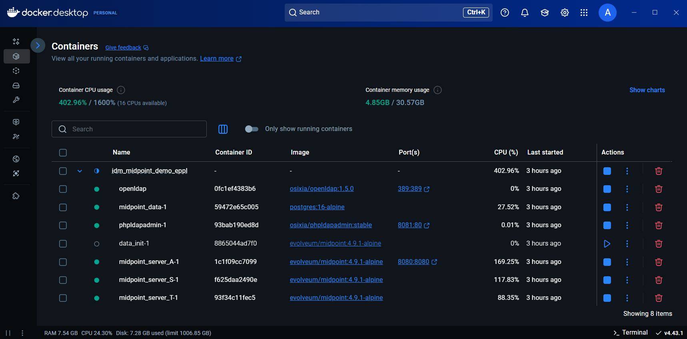

</img> 
 
Midpoint 
http://localhost:8080/midpoint/ 
Username: administrator 
Password: Test5ecr3t 
 
phpLDAPadmin 
http://localhost:8081 
Login DN: cn=admin,dc=example,dc=com 
Password: Test5ecr3t 
 
 
 
<b>Docker Compose</b> 
For the Docker Compose, the Docker environment is required and Internet connection on first run. 
 
<b>Linux</b> 
Copy folder IDM_Midpoint_DEMO_EPPL 
To start 
./IDM_Midpoint_DEMO_EPPL/docker compose up -d 
To turn off 
./IDM_Midpoint_DEMO_EPPL/docker compose down 
Tu turn off and delete any changes 
./IDM_Midpoint_DEMO_EPPL/docker compose down -v
