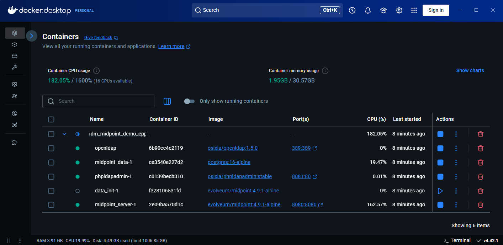

</img> 
  
:warning: Don't forget to run the Reindex Repository Object in ADMINISTRATION\About on first administartor login, after first start of Docker Compose.
  
Midpoint 
http://localhost:8080 
Username: administrator 
Password: Test5ecr3t 
 
Username: *Any User* 
Password: Password123 
 
phpLDAPadmin 
http://localhost:8081 
Login DN: cn=admin,dc=example,dc=com 
Password: Test5ecr3t 
 
 
<b>Docker Compose</b> 
For the Docker Compose, the Docker environment(Docker Desktop) is required and Internet connection on first run. 
 
<b>Linux</b> 
Copy folder IDM_Midpoint_DEMO_EPPL 
Start Docker Desktop 
./IDM_Midpoint_DEMO_EPPL/docker compose up -d 
To turn off 
./IDM_Midpoint_DEMO_EPPL/docker compose down 
Tu turn off and delete any changes 
./IDM_Midpoint_DEMO_EPPL/docker compose down -v
<b>  
<b>Windows</b> 
 
IDM Midpoint EPPL | 1. Docker Compose first run 

  

Version: 
<b>EPPL 1.01 18.07.25</b> 
Compatibility: Evolveum midPoint 4.9.1 
Incompatible: Evolveum midPoint 4.9.2,4.9.3 - due to Evolveum BUG for Person of interest filters in GUI Request access 
<b>Changes with Respect To Version EPPL 1.0 30.06.25</b> 
- Added Login Stop List 
- Added Infinitely Logins (numbers are added to the end of the login) 
- Added Head Department inherits Company Name 
- Added personalNumber in Search Box of views All Users, My IDM Subordinates, All Account Users, Employment Users, Position Users 
- Added filter "Dep.Managers only" in Search Box of view Position Users 
- Faster first Reconcilation in some Resources with Multi-node 
- Improved Task "EPPL delete nickName without members" for "Login Stop List" 
- Impoved Login/nickName generation Script for "Login Stop List" and "Infinitely Logins" 
- Moved from view Persons to view All Account Users in Search Box "Users with account" and "Users without account" 
- Fixed EPPL RED Error: GUI Boss Request LDAP account to own Position 
- Fixed EPPL All Account Users name in Search Box Object Collection list 
- Changed the color and text of the warning "not authorized for operation" to avoid scaring employees in their GUI 
- ...other last minute changes 

<b>Under Development</b> 
EPPL 1.02 01.09.25 
- Added Manager delegation of Manager status of Department 
- Improved Forward Role inhereted role assignment inducement mechanism 
- Improved Forward Role role link, no more writing from object Temlate only from assignments 
- Improved Departament manager-subordinate mechanism 
- Improved Person-Employment Role main employment to organization mechanism 
